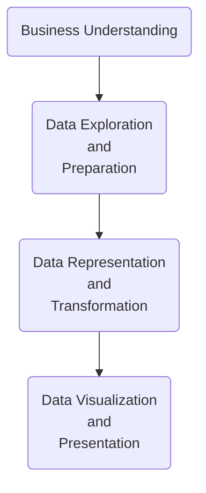

# From-Data-to-Action-Leveraging-SQL-and-Tableau-for-Marketing-and-Analytics
## Unlocking Business Intelligence: A Combined Approach with SQL and Tableau
# 📝 Table of Contents
- [About](#about)
- [Demo](#demo)
- [Business Understanding](#workflow)
- [Data Understanding](#data_undestanding)
- [Screenshot of Visualization/Result](#screenshot)
- [Database Model Diagram](#database)
- [Technologies](#techs)
- [Setup](#setup)
- [Approach](#approach)
- [Status](#status)
- [Credits](#credits)
- [Disclaimer](#Disclaimer)
## About 
Unveiling the Story: SQL & Tableau for Effective Business Analysis & Data Management.  
Merge coding skills and business acumen to solve complex analytical problems.
## Demo 

## Business Understanding 
**In Progress** 
>[!NOTE]
>

## Data Understanding 
**In Progress** 
## Screenshot of Visualization/Result 
**In Progress** 
## 🗄️ Database Model Diagram 
**In Progress** 
## Technologies 

This project leverages a powerful combination of technologies to extract insights from data and present them in a visually compelling way.

### SQL (Structured Query Language)  
The foundation of our data analysis. SQL acts as our query language, allowing us to interact with relational databases like MySQL and efficiently retrieve, manipulate, and analyze the data relevant to our business questions.

### MySQL
Our data storage engine. MySQL is a popular open-source relational database management system (RDBMS) that stores our data in a structured and organized manner. SQL queries directly interact with the data stored within MySQL.

### Tableau
The visualization powerhouse.  Tableau is a data visualization software that transforms the data retrieved and analyzed through SQL into interactive dashboards and reports.  This allows us to present complex information in a clear, concise, and easily understandable way, making it perfect for communication and data exploration.

**By combining the power of SQL for data retrieval and manipulation, MySQL for data storage, and Tableau for visualization, this project unlocks valuable insights that can be used to inform business decisions, improve marketing effectiveness, and optimize data management.**
## Setup <a name="setup"><a/>
This project utilizes a three-pronged approach for data analysis and visualization:

**Data Access with SQL:** We'll be using SQL (Structured Query Language) to interact with our data source. Familiarity with basic SQL commands like SELECT, FROM, WHERE, JOIN, and aggregation functions (COUNT, SUM, AVG) is recommended.

**Data Storage with MySQL:** We'll leverage MySQL, a popular open-source relational database management system (RDBMS), to store our data. If you don't have MySQL installed, several options exist:

- Download and install the MySQL Community Server from the official website https://dev.mysql.com/downloads/mysql/.
- Use a cloud-based MySQL service offered by various providers.
- Utilize a lightweight desktop application like MySQL Workbench for managing databases.

**Data Visualization with Tableau:** We'll be using the free Tableau Desktop to get started. The free plan provides a great introduction to Tableau's functionality and allows you to create visualizations. For more info please check https://public.tableau.com/app/discover

Here are some additional options for using Tableau:

- Using the free trial: While the free trial offers valuable features, keep in mind limitations like limited data access and export options.
- Consider a paid subscription to Tableau Desktop: This unlocks the full potential of Tableau, allowing you to connect to larger datasets, create more complex visualizations, and collaborate with others.
- Explore alternatives: Several open-source data visualization tools exist, like Apache Zeppelin or Google Data Studio. These may not offer the same level of functionality as Tableau, but they can be good options for basic visualization needs.

**Connecting SQL and MySQL:** Once you have SQL and MySQL set up, you'll need to establish a connection between them. This typically involves specifying the server hostname, database name, username, and password within your chosen SQL client or interface.

**Preparing Data in MySQL:** Before diving into analysis, ensure your data is properly structured and imported into your MySQL database. This may involve creating tables with relevant columns and populating them with the data you wish to analyze. Tools like phpMyAdmin or the MySQL command line can be used for data management within MySQL.

**Connecting Tableau to MySQL:** Tableau allows you to connect directly to your MySQL database. You'll need to provide the same connection details used for your SQL client, allowing Tableau to access and visualize the data stored within MySQL.

By setting up these tools and establishing the connections, you'll be ready to leverage the power of SQL for data exploration, MySQL for data storage, and Tableau for creating impactful data visualizations!

## Approach  
To bring data to life and implement an effective, actionable insight following steps of data science methodology were taken: 

## Status <a name="status"><a/>
**In Progress** 
This project is currently underway, utilizing SQL queries to access data stored within the MySQL database. We're actively exploring and analyzing the data to extract valuable insights for business analysis, marketing efforts, and data management.

The next steps will involve:

**Continuing data exploration and analysis:** We'll leverage SQL to delve deeper into the data, uncovering trends, patterns, and relationships that can inform our findings. 
**Data visualization with Tableau:** Once we have a solid understanding of the data, we'll utilize Tableau to create interactive dashboards and reports. Even with the free trial of Tableau Desktop, we can create clear and insightful visualizations to communicate our discoveries. 
**Refining and iterating:** As we progress, we may need to revisit previous steps to refine our analysis or data preparation based on new insights. 
We'll keep this section updated to reflect the project's progress as we move forward.
## Credits 
- This project is built upon the foundation of knowledge acquired through the highly-rated Udemy course, [SQL - MySQL for Data Analytics and Business Intelligence](https://www.udemy.com/course/sql-mysql-for-data-analytics-and-business-intelligence/?couponCode=ST8MT40924) offered by [365 Careers](https://365datascience.com/) . Course is availbe on [Udemy Platform](https://www.udemy.com/)

- Copyright (C) 2007,2008, MySQL AB
-  Original data created by Fusheng Wang and Carlo Zaniolo
-  http://www.cs.aau.dk/TimeCenter/software.htm
-  http://www.cs.aau.dk/TimeCenter/Data/employeeTemporalDataSet.zip

-  Current schema by Giuseppe Maxia 
-  Data conversion from XML to relational by Patrick Crews

- This work is licensed under the  Creative Commons Attribution-Share Alike 3.0 Unported License. 
- To view a copy of this license, visit  http://creativecommons.org/licenses/by-sa/3.0/ or send a letter to Creative Commons, 171 Second Street, Suite 300, San Francisco, California, 94105, USA.
##  Disclaimer 
To the best of our knowledge, this data is fabricated, and it does not correspond to real people. Any similarity to existing people is purely coincidental.

