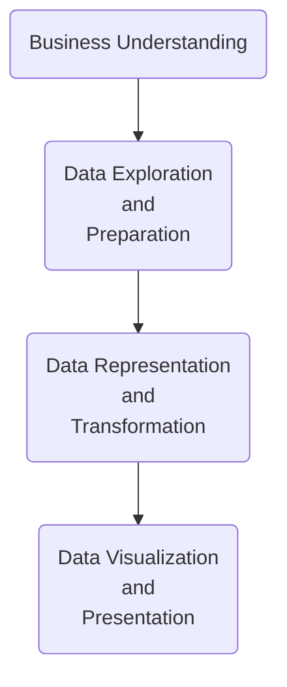

# From-Data-to-Action-Leveraging-SQL-and-Tableau-for-Marketing-and-Analytics
## Unlocking Business Intelligence: A Combined Approach with SQL and Tableau
# 📝 Table of Contents
- [About](#about)
- [Demo](#demo)
- [Business Understanding](#workflow)
- [Data Understanding](#data_undestanding)
- [Screenshot of Visualization/Result](#screenshot)
- [Database Model Diagram](#database)
- [Technologies](#techs)
- [Setup](#setup)
- [Approach](#approach)
- [Status](#status)
- [Credits](#credits)
- [Disclaimer](#Disclaimer)
## About 
### Unveiling the Story: SQL & Tableau for Effective Business Analysis & Data Management.  
Merge coding skills and business acumen to solve complex analytical problems. This project explores the gender composition of a company's workforce, leveraging the power of SQL and Tableau for data analysis and visualization. 
- What I do are as following:  
1. Recive a business task
2. Use Sql to execute a query retriving a relevant dataset from database
3. Export the newly obtained data in a csv file to used in Tableau
4. Create a professinal and understandable visualization in Tableau that respand to the business task wich help end user to come up with business insight
- How I do that?
1. Data exploration and data validation
  2. Union data
  3. Use Mysql stored procedures
  4. Reorganizing data
  5. Visualization  
### Technical Approach:
#### Data Sources:
I utilized two database management systems for this project: 
- **MySQL:** Potentially used to store the raw employee and department data. 
- **SQL Server:** Potentially used for data manipulation, analysis, and potentially storing the final dataset. 
#### Data Manipulation and Analysis:
I employed SQL (Structured Query Language) to: 
- **Define functions:** Reusable blocks of code performing specific calculations relevant to gender,role demographics (e.g., calculating average salary by gender, role, title ,...). 
- **Create procedures:** Stored routines encapsulating complex calculations or data transformations frequently used in the analysis (e.g., a procedure to calculate gender staffing breakdown across departments). 
- **Run queries:** Execute specific commands to extract and analyze workforce data. This could involve filtering by department, year, or gender, calculating ratios and averages, and joining tables for a comprehensive view. 
The final processed data containing insights like gender staffing breakdown, earning ratios, and management representation was exported for visualization.
#### Data Visualization:
Tableau, a powerful data visualization tool, was used to create interactive dashboards. 
The exported data was connected to Tableau, allowing for the creation of charts, graphs, and other visual representations of workforce demographics. 
- **Benefits:** 
**Improved Data Understanding:** By leveraging SQL functions, procedures, and targeted queries, we were able to transform raw data into meaningful insights. 
**Interactive Exploration:** Tableau empowers users to explore workforce data dynamically, fostering deeper understanding and data-driven decision making. 
**Transparency and Communication:** The interactive dashboards provide clear visualizations, promoting transparency around workforce demographics for stakeholders.
>[!NOTE]
>This project demonstrates the valuable synergy between SQL for data manipulation and Tableau for interactive visualization, enabling us to paint a clear picture of the company's workforce composition.

## Demo 
**Let's unlock valuable insights into the workforce and work towards a more inclusive and equitable future.**  

Welcome to this [interactive dashboard](https://public.tableau.com/views/HumanResourceDashboard_17138904446890/HumanResourcesDashboard?:language=en-US&:sid=&:display_count=n&:origin=viz_share_link) exploring the composition of workforce . This visualization, built using Tableau, delves into key metrics like gender staffing breakdown, earning ratios across genders and years, departmental distribution, and representation in leadership positions. 
- Key Insights at a Glance:

1. **Gender Composition:** Gain a clear picture of the overall gender balance within the company and across departments.
2. **Earnings Parity:** Explore trends in gender pay equity over time to identify potential areas for improvement.
3. **Departmental Representation:** See how genders are distributed across different departments within the organization.
4. **Management Roles:** Analyze the proportion of women and men in leadership positions.  

**Interactive Exploration:**

- This dashboard empowers you to:

1. **Filter:** Focus on specific departments or years to gain deeper insights.
2. **Drill Down:** Explore details behind the visualizations for granular analysis.
3. **Compare:** juxtapose metrics to identify trends and patterns.

## Business Understanding 
**In Progress** 
>[!NOTE]
> For more information about detailed steps and phase please check project documentation [here]()

## Data Understanding 
Understanding the intricacies of employee data within an organization is crucial for strategic decision-making, workforce management, and fostering a productive work environment. This data understanding document delves into a comprehensive analysis of a relational database containing employee information, departmental assignments, and historical records of job titles and salaries. 

The dataset encapsulates the core aspects of **employee lifecycle management, from recruitment to departmental affiliations, managerial transitions, and career progression**. By exploring this dataset, we aim to **uncover valuable insights into employee demographics, organizational dynamics, and patterns of employee engagement.**  

This document outlines the structure of the database, key relationships between tables, challenges encountered during data analysis, and the focus areas of exploration. Through this analysis, I seek to gain actionable insights that can inform **organizational strategies, enhance workforce planning, and optimize employee engagement initiatives.**
### Tables Overview
-**departments** (9 rows, 2 columns): Stores basic department information (department number and name). 
- **dept_emp** (331,143 rows, 4 columns):Links employees to departments, capturing assignment periods (employee number, department number, start date, end date). This table plays a crucial role in understanding employee history within departments. 
dept_manager (24 rows, 4 columns):
Tracks historical information about departmental managers (employee number, department number, start date, end date).
employees (299,025 rows, 6 columns):
Stores core employee information (unique employee ID, birth date, name, gender, hire date).
salaries (965,756 rows, 4 columns):
Maintains a history of employee salaries (employee number, salary amount, start date, end date).
titles (441,594 rows, 4 columns):
Tracks employee job titles over time (employee number, job title, start date, end date).
Key Relationships
The key relationship lies in the dept_emp table (with over 331,000 entries), where a single employee might have multiple rows reflecting assignments to different departments throughout their employment.

Data Quality
While we didn't encounter missing values in the traditional sense, the structure of the dept_emp table presented a challenge:

Multiple Department Assignments: Employees can have multiple rows in dept_emp with different departments (over 331,000 entries indicate a potentially dynamic workforce with departmental changes).
Addressing Department Assignments
To accurately retrieve employee information considering their departmental history, we employed calculated nested queries. These queries navigated the dept_emp table, considering start and end dates of assignments to ensure we captured the correct departmental affiliation for each employee at a specific point in time.

Data Exploration and Analysis Focus
This project focuses on analyzing employee demographics, particularly regarding department assignments. We will leverage the employees, dept_emp, and potentially other relevant tables to explore:

Overall gender distribution within the workforce.
Departmental distribution of genders, considering the dynamic nature of assignments as reflected in the dept_emp table (over 331,000 entries).
Potential trends in departmental changes over time (considering dept_emp start and end dates).
Exporting Data for Visualization (Optional)
Following our analysis using SQL, we can export the results to formats suitable for visualization in tools like Tableau. Common export formats include CSV (comma-separated values) and Excel spreadsheets.

## Screenshots of Code, Visualization and Result 

  

  

## 🗄️ Database Model Diagram 
Check out the DB Model Diagram [here](https://dbdiagram.io/d/Employees-6617bcb803593b6b61c01ea1)

## Technologies 

This project leverages a powerful combination of technologies to extract insights from data and present them in a visually compelling way.

### SQL (Structured Query Language)  
The foundation of our data analysis. SQL acts as our query language, allowing us to interact with relational databases like MySQL and efficiently retrieve, manipulate, and analyze the data relevant to our business questions.

### MySQL
Our data storage engine. MySQL is a popular open-source relational database management system (RDBMS) that stores our data in a structured and organized manner. SQL queries directly interact with the data stored within MySQL.

### Tableau
The visualization powerhouse.  Tableau is a data visualization software that transforms the data retrieved and analyzed through SQL into interactive dashboards and reports.  This allows us to present complex information in a clear, concise, and easily understandable way, making it perfect for communication and data exploration.

**By combining the power of SQL for data retrieval and manipulation, MySQL for data storage, and Tableau for visualization, this project unlocks valuable insights that can be used to inform business decisions, improve marketing effectiveness, and optimize data management.**
## Setup <a name="setup"><a/>
This project utilizes a three-pronged approach for data analysis and visualization:

**Data Access with SQL:** We'll be using SQL (Structured Query Language) to interact with our data source. Familiarity with basic SQL commands like SELECT, FROM, WHERE, JOIN, and aggregation functions (COUNT, SUM, AVG) is recommended.

**Data Storage with MySQL:** We'll leverage MySQL, a popular open-source relational database management system (RDBMS), to store our data. If you don't have MySQL installed, several options exist:

- Download and install the MySQL Community Server from the official website https://dev.mysql.com/downloads/mysql/.
- Use a cloud-based MySQL service offered by various providers.
- Utilize a lightweight desktop application like MySQL Workbench for managing databases.

**Data Visualization with Tableau:** We'll be using the free Tableau Desktop to get started. The free plan provides a great introduction to Tableau's functionality and allows you to create visualizations. For more info please check https://public.tableau.com/app/discover

Here are some additional options for using Tableau:

- Using the free trial: While the free trial offers valuable features, keep in mind limitations like limited data access and export options.
- Consider a paid subscription to Tableau Desktop: This unlocks the full potential of Tableau, allowing you to connect to larger datasets, create more complex visualizations, and collaborate with others.
- Explore alternatives: Several open-source data visualization tools exist, like Apache Zeppelin or Google Data Studio. These may not offer the same level of functionality as Tableau, but they can be good options for basic visualization needs.

**Connecting SQL and MySQL:** Once you have SQL and MySQL set up, you'll need to establish a connection between them. This typically involves specifying the server hostname, database name, username, and password within your chosen SQL client or interface.

**Preparing Data in MySQL:** Before diving into analysis, ensure your data is properly structured and imported into your MySQL database. This may involve creating tables with relevant columns and populating them with the data you wish to analyze. Tools like phpMyAdmin or the MySQL command line can be used for data management within MySQL.

**Connecting Tableau to MySQL:** Tableau allows you to connect directly to your MySQL database. You'll need to provide the same connection details used for your SQL client, allowing Tableau to access and visualize the data stored within MySQL.

By setting up these tools and establishing the connections, you'll be ready to leverage the power of SQL for data exploration, MySQL for data storage, and Tableau for creating impactful data visualizations!
>[!NOTE]
> Leveraging open-source and accessible software, we opted for MySQL and Tableau Public. Alternatively, for those with the expertise, custom SQL can offer greater speed and efficiency.
## Approach  
To bring data to life and implement an effective, actionable insight following steps of data science methodology were taken: 

## Status <a name="status"><a/>
**In Progress** 
This project is currently underway, utilizing SQL queries to access data stored within the MySQL database. We're actively exploring and analyzing the data to extract valuable insights for business analysis, marketing efforts, and data management.

The next steps will involve:

**Continuing data exploration and analysis:** We'll leverage SQL to delve deeper into the data, uncovering trends, patterns, and relationships that can inform our findings. 
**Data visualization with Tableau:** Once we have a solid understanding of the data, we'll utilize Tableau to create interactive dashboards and reports. Even with the free trial of Tableau Desktop, we can create clear and insightful visualizations to communicate our discoveries. 
**Refining and iterating:** As we progress, we may need to revisit previous steps to refine our analysis or data preparation based on new insights. 
We'll keep this section updated to reflect the project's progress as we move forward.
## Credits 
- This project is built upon the foundation of knowledge acquired through the highly-rated Udemy course, [SQL - MySQL for Data Analytics and Business Intelligence](https://www.udemy.com/course/sql-mysql-for-data-analytics-and-business-intelligence/?couponCode=ST8MT40924) offered by [365 Careers](https://365datascience.com/) . Course is availbe on [Udemy Platform](https://www.udemy.com/)

- Copyright (C) 2007,2008, MySQL AB
-  Original data created by Fusheng Wang and Carlo Zaniolo
-  http://www.cs.aau.dk/TimeCenter/software.htm
-  http://www.cs.aau.dk/TimeCenter/Data/employeeTemporalDataSet.zip

-  Current schema by Giuseppe Maxia 
-  Data conversion from XML to relational by Patrick Crews

- This work is licensed under the  Creative Commons Attribution-Share Alike 3.0 Unported License. 
- To view a copy of this license, visit  http://creativecommons.org/licenses/by-sa/3.0/ or send a letter to Creative Commons, 171 Second Street, Suite 300, San Francisco, California, 94105, USA.
##  Disclaimer 
To the best of our knowledge, this data is fabricated, and it does not correspond to real people. Any similarity to existing people is purely coincidental.

